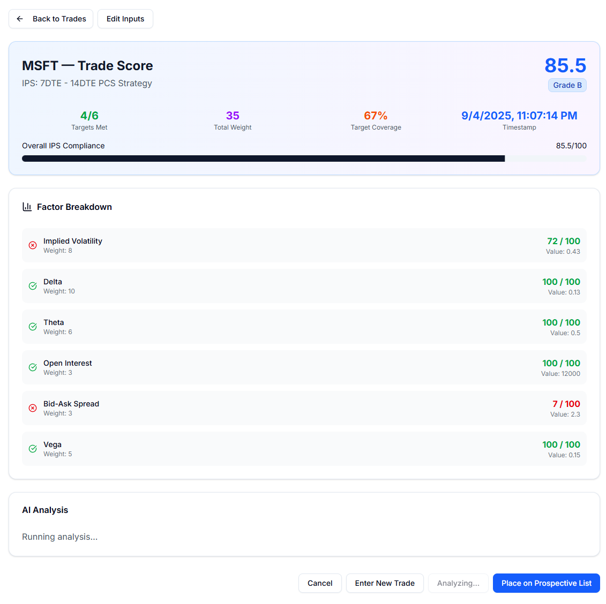
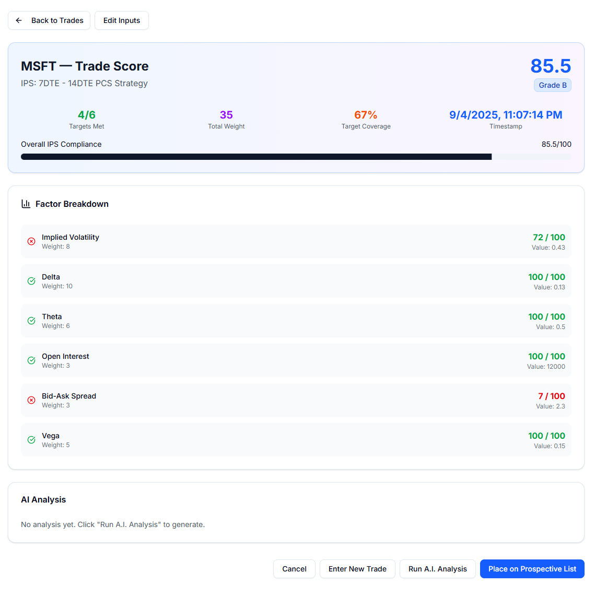
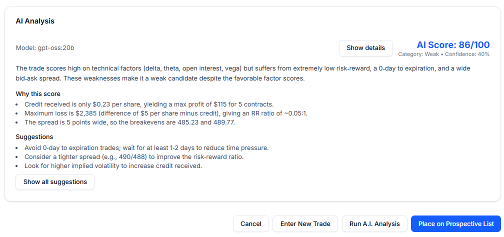
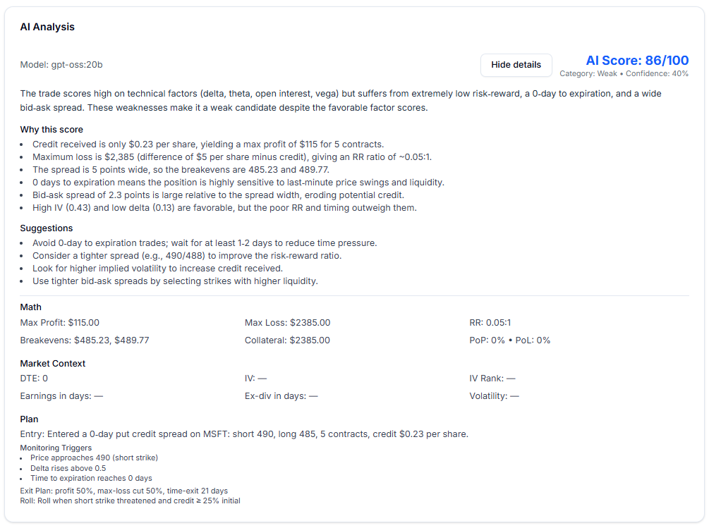

# Tenxiv — AI-Enhanced Trade Analysis

Focused trade journaling with IPS‑weighted scoring, powered by **LangGraph.js** for multi-agent workflow orchestration and LLM-driven trade analysis.

## What's New

- **LangGraph.js Integration**: Multi-node agent workflow with StateGraph for options trade analysis
- **StructuredTool Implementation**: 4+ tools (GetQuote, GetCompanyOverview, SearchNews, GetOptionsChain) with Zod schemas
- **Model Binding**: Tools bound to LLM via LangChain for dynamic tool calling during analysis
- **Deep Reasoning**: Multi-phase analysis with IPS validation, historical context, and market research synthesis
- Alpha Vantage ticker search in the New Trade form (typeahead powered by SYMBOL_SEARCH)
- API factor auto‑fetch once a symbol is chosen
- Ollama tool‑calling for market lookups during AI analysis

## UI Snapshots
The A.I. is used once a trade is entered and scored based off an Investment Policy.



Once the "Run A.I. Analysis is clicked it will make a call to the A.I. (Ollama or GPT).


The output is a simplifed analysis. The system prompt is instructed to keep it short, but it provides a more extensive version that can be selected.


This is a screenshot of what a detailed analysis looks like.


## Walkthrough
<video src="/screenshots/Tenxiv_AI_Walkthrough_V1.mp4" controls playsinline muted style="max-width:100%;height:auto;"></video>
 
If the embed doesn’t load, download/watch:
`public/screenshots/Tenxiv_AI_Walkthrough_V1.mp4`

## LangGraph.js Agent Architecture

The AI agent is built using **LangGraph.js** with the following components:

### Graph Nodes (Connected START → END)

1. **FetchMarketData**: Retrieves options chains and quotes from Alpha Vantage
2. **FetchMacroData**: Fetches macro indicators (Fed Funds, Unemployment, Term Spread) from FRED
3. **EngineerFeatures**: Computes IV rank, term slope, put skew, volume/OI ratios
4. **GenerateCandidates**: Creates put credit spread candidates with proper OTM filtering
5. **RiskGuardrails**: Checks for earnings events and macro risks using Tavily search
6. **DeepReasoning**: Multi-phase analysis including IPS compliance, historical context, and threshold adjustments
7. **ScoreIPS**: Scores candidates against IPS criteria with detailed factor-by-factor breakdown
8. **LLM_Rationale**: Generates natural language trade rationale with news context
9. **SelectTopK**: Ranks and selects top 10 candidates

### StructuredTool Definitions (src/lib/agent/tools.ts)

All tools use `StructuredTool` from `@langchain/core/tools` with Zod schemas:

- **GetQuoteTool**: Fetches current stock quotes (price, volume, change)
- **GetCompanyOverviewTool**: Retrieves fundamentals (PE, beta, market cap, sector, financials)
- **SearchNewsTool**: Searches recent news using Tavily API
- **GetOptionsChainTool**: Fetches options chain data (strikes, IVs, greeks, OI)

### Model Binding

Tools are bound to the LLM before invocation:

```typescript
import { ChatOllama } from "@langchain/ollama";
import { agentTools } from "@/lib/agent/tools";

const model = new ChatOllama({ model: "llama3" });
const modelWithTools = model.bind({ tools: agentTools });
```

### Running the Agent

```bash
POST /api/agent/run
{
  "symbols": ["AAPL", "MSFT"],
  "mode": "paper",
  "ipsId": "uuid-of-ips-config"
}
```

The agent runs the full graph, executing each node sequentially, and returns scored trade candidates with detailed IPS analysis.

## Trade Scoring Flow

- Create IPS: define factors and weights (`POST /api/ips`).
- Load factors for a symbol: `GET /api/trades/factors?symbol=SYM&ipsId=...`.
- Compute IPS score: `POST /api/trades/score` with `ipsId` and `factorValues`.
- Create trade: `POST /api/trades` with `userId`, `ipsId`, `tradeData`, and optional `ipsScore/scoreId`.
- Manage lifecycle: `GET /api/trades`, `PATCH /api/trades`, `DELETE /api/trades`.

## API Endpoints (LLM + IPS/Trades)

| Method | Path | Description |
|---|---|---|
| GET | `/api/health` | Express: health check for LLM server. |
| POST | `/api/llm/analyze` | Express: analyze a trade via Ollama (JSON result). |
| POST | `/api/ips` | Create an IPS with factor rows (ids or names resolved). |
| GET | `/api/ips` | List IPS configurations (with factor counts). |
| PUT | `/api/ips` | Update an IPS and replace factors. |
| GET | `/api/ips/[id]` | Retrieve a single IPS with factors. |
| GET | `/api/ips/[id]/factors` | UI‑ready factor shape for a specific IPS. |
| GET | `/api/trades` | List trades (filter by `userId`, `status`, or `id`). |
| POST | `/api/trades` | Create a prospective trade and persist metrics. |
| PATCH | `/api/trades` | Bulk update trade status; stamps `entry_date` on `active`. |
| DELETE | `/api/trades` | Bulk delete trades. |
| POST | `/api/trades/score` | Compute IPS weighted score from factor values. |
| GET | `/api/trades/factors` | Fetch factor values for a symbol under an IPS. |
| POST | `/api/trades/factors` | Save/override a single factor value. |

## Iterative Engineering & Testing

### Development Process

The LangGraph agent was developed iteratively with extensive testing at each stage:

1. **Schema Refinement**: Tool schemas were refined through multiple iterations to ensure the LLM receives properly structured data
2. **Error Handling**: Comprehensive try-catch blocks and retry logic (using `p-retry`) to handle API failures gracefully
3. **Rate Limiting**: Implemented `p-queue` to respect API rate limits (2 requests/second for Alpha Vantage)
4. **Validation**: Each node validates its inputs and outputs, logging detailed information for debugging
5. **Postman Testing**: All API endpoints tested thoroughly via Postman with various input combinations
6. **UI Integration**: Frontend components tested with real agent output to ensure proper data rendering

### Testing with Postman

1. **Agent Run Endpoint**:
   ```json
   POST http://localhost:3000/api/agent/run
   {
     "symbols": ["AAPL", "MSFT", "GOOGL"],
     "mode": "paper",
     "ipsId": "your-ips-uuid-here"
   }
   ```

2. **Verify IPS Loading**:
   ```json
   GET http://localhost:3000/api/ips/{ipsId}
   ```

3. **Check Candidates**:
   ```json
   GET http://localhost:3000/api/agent/candidates?runId={runId}
   ```

### Key Improvements Made

- **Tool Schema Descriptions**: Enhanced tool descriptions to guide LLM on when and how to use each tool
- **Data Validation**: Added validation layers to ensure data integrity throughout the graph
- **Error Recovery**: Implemented fallback mechanisms when tools fail (e.g., using placeholder values for IV rank if real data unavailable)
- **Performance Optimization**: Parallel data fetching where possible, sequential only when dependencies exist
- **Logging**: Comprehensive logging at each node for debugging and monitoring

## Environment

- `ALPHA_VANTAGE_API_KEY` required for quotes, fundamentals and search.
- Optional: `ALPHA_VANTAGE_MIN_DELAY_MS` tiny throttle between sequential AV calls (default 100ms).
- Optional: `ALPHA_VANTAGE_DAILY_BUDGET` local guard for `/api/market-data` route (default 50000).
- `TAVILY_API_KEY` required for news search functionality.

LLM / Express server:
- `OLLAMA_HOST` (default `http://golem:11434`) — connect via Tailscale
- `OLLAMA_MODEL` (recommended `gpt-oss:120b` or `llama4:maverick`)

Run locally:
- `npm run server` (starts Express at `http://localhost:4000`)
- `npm run dev` (starts Next.js)

Postman usage:
- Import `POST /api/llm/analyze` and send a JSON body:
```
{
  "trade": { "symbol": "AAPL", "contractType": "put-credit-spread", "expirationDate": "2025-10-18", "numberOfContracts": 1, "shortPutStrike": 190, "longPutStrike": 185, "creditReceived": 1.25 },
  "ipsName": "PCS Conservative",
  "strategyType": "put-credit-spread",
  "model": "llama4:maverick"
}
```
Response is strict JSON with `score`, `summary`, `rationale_bullets`, `math`, `market_context`, `plan`, and `suggestions`.

## Tool Calling (Express)

- Tools are defined and passed to Ollama via the `tools` parameter in `server.js`:
  - `search_symbols(query, limit?)`: Alpha Vantage SYMBOL_SEARCH.
  - `get_quote(symbol)`: Alpha Vantage GLOBAL_QUOTE.
  - `get_overview(symbol)`: Alpha Vantage OVERVIEW fundamentals.
- When the model requests a tool call, the server executes the function (fetches data from Alpha Vantage), then appends a `tool` role message containing the JSON result and calls Ollama again to let the model incorporate the output.
- The server preserves the message sequence through 2 tool rounds and returns a strict JSON response for programmatic use.
